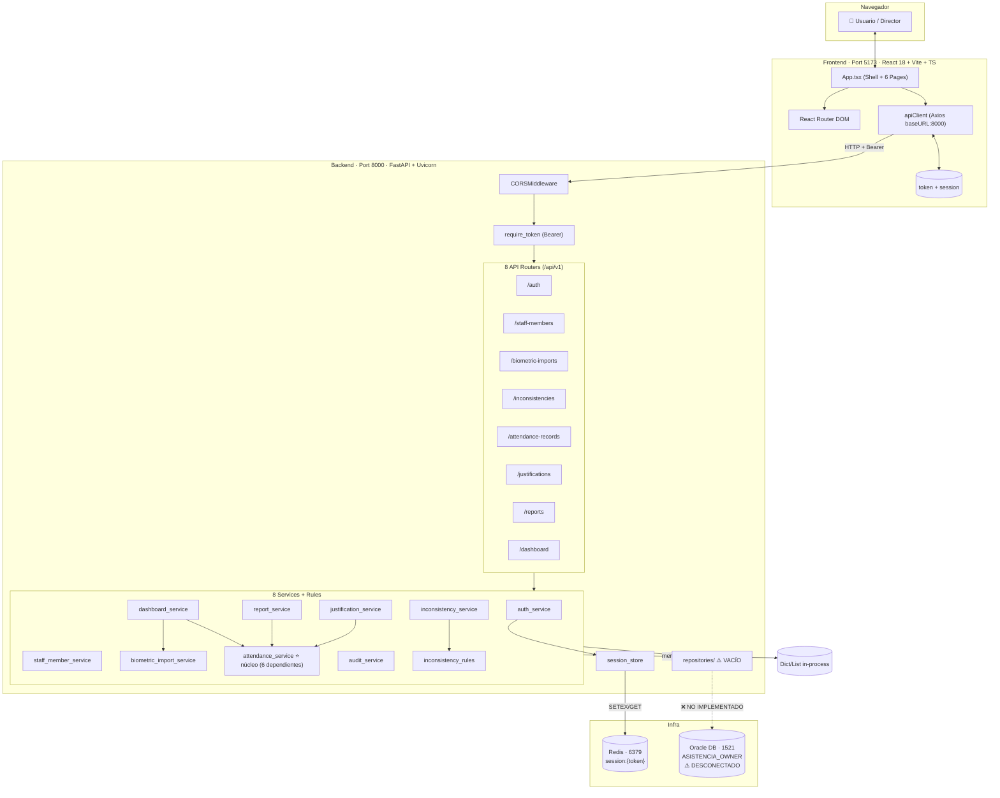
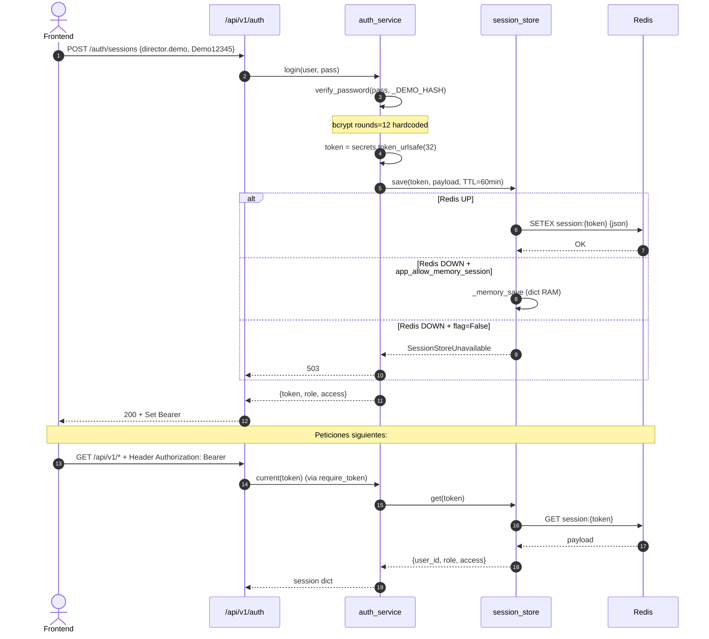
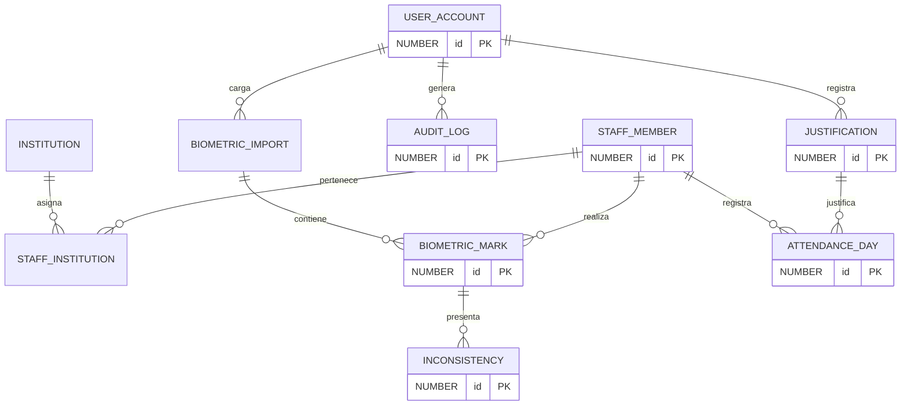
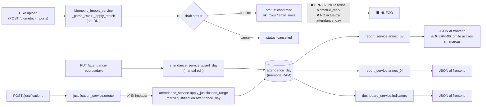
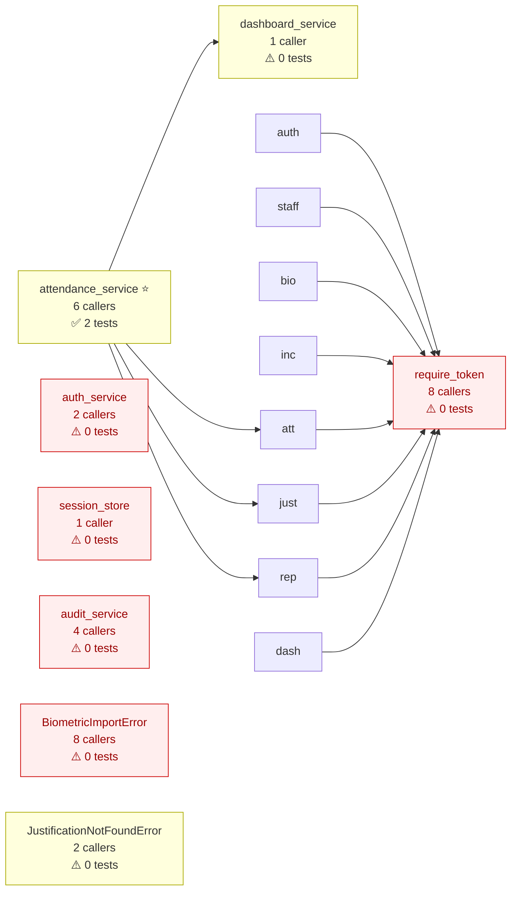
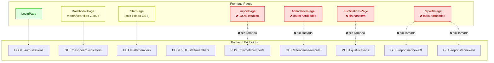

# Auditoría Técnica Completa — CHIQUISTRUKIS (Control de Asistencia UGEL)

> **Repo**: `wilberth830/control-asistencia-ugel-maestria` · rama `feature/build-project-with-codex`
> **Método**: Análisis estático con CodeGraph (435 nodos, 773 relaciones) + exploración SDD
> **Modo**: READ-ONLY — No se modificó ningún archivo
> **Fecha**: 2026-08-11

---

## 1. Resumen Ejecutivo (una prueba)

| Severidad | Cantidad | Descripción |
|-----------|----------|-------------|
| 🔴 **CRÍTICO** | 6 | Rompen funcionalidad core o persistencia |
| 🟠 **ALTO** | 9 | Funcionalidades incompletas o desconectadas |
| 🟡 **MEDIO** | 5 | Defectos parciales que degradan UX o confiabilidad |
| 🔵 **BAJO** | 4 | Gaps de cobertura de tests o documentación |
| **Total** | **24** | Hallazgos clasificados |

**Índice CodeGraph**: 47 archivos · 2 suites de tests (5 archivos) · blast radius confirma `attendance_service` como núcleo con 6 dependientes.

---

## 2. Inventario de Errores por Capa

### 2.1 🔴 Capa de Persistencia / Base de Datos (CRÍTICOS)

#### ERR‑01 · Persistencia 100% en memoria RAM (Mock Mode)
| Campo | Valor |
|-------|-------|
| **Severidad** | 🔴 CRÍTICO |
| **Archivo** | `backend/app/services/*.py` |
| **Categoría** | Persistence gap · Mock mode |

**Problema**: Todos los servicios operan sobre listas y dict en memoria RAM:
- `staff_member_service.py:14` → `self._rows: list[dict] = []` con `reset_demo_data()`
- `attendance_service.py:11` → `self._days: dict[str, dict] = {}`
- `justification_service.py:22` → `self._items: dict[int, dict] = {}`
- `biometric_import_service.py:25` → `self._imports: dict[int, dict] = {}`
- `audit_service.py:13` → `self._memory: list[dict] = []`

**Impacto**: Al reiniciar el servidor FastAPI se pierden todos los datos. El DDL Oracle (`database/01_schema/01_create_tables.sql` con 11 tablas) NO está conectado a ningún repositorio. La carpeta `backend/app/repositories/` está **vacía** (solo `__init__.py`).

**Evidencia**:
```python
# audit_service.py:37
# TODO: INSERT INTO audit_log when Oracle repository is wired
```

```python
# config.py:21
app_use_demo_store: bool = True
```

---

#### ERR‑02 · Confirmación biométrica huérfana (no impacta attendance_day)
| Campo | Valor |
|-------|-------|
| **Severidad** | 🔴 CRÍTICO |
| **Archivo** | `backend/app/services/biometric_import_service.py:97-111` |
| **Categoría** | Incomplete flow |

**Problema**: El método `confirm(import_id)` cambia el estado a `"confirmed"` y actualiza contadores `ok_rows`/`error_rows`, pero **no genera marcaciones en `biometric_mark` ni consolida `attendance_day`**.

**Impacto**: El flujo principal del sistema (cargar biométrico → procesar asistencia → generar Anexos) está **truncado en el medio**. Los reportes del Anexo 03/04 dependen de `attendance_day`, que jamás se pobla desde las cargas biométricas confirmadas.

**Evidencia**:
```python
# biometric_import_service.py:97
def confirm(self, import_id: int) -> dict[str, Any]:
    imp = self._find(import_id)
    if imp["status"] != "draft":
        raise BiometricImportError("conflict_not_draft")
    # ... validación de unresolved_new_rows ...
    imp["status"] = "confirmed"
    imp["ok_rows"] = sum(...)
    imp["error_rows"] = sum(...)
    # ❌ NO crea biometric_mark, NO actualiza attendance_day
    return deepcopy(imp)
```

---

#### ERR‑03 · Endpoint de inconsistencias desconectado y hardcoded
| Campo | Valor |
|-------|-------|
| **Severidad** | 🔴 CRÍTICO |
| **Archivo** | `backend/app/api/inconsistencies.py:11, 17-27` |
| **Categoría** | Disconnected endpoint · Mock |

**Problema**: El endpoint `GET /api/v1/inconsistencies` invoca `inconsistency_service.analyze([])` — siempre recibe una lista **vacía**. El motor de reglas (`detect_basic_issues`) itera sobre `marks`, por lo que con `[]` nunca detecta nada.

Los endpoints `POST /{id}/review` y `POST /{id}/correction` **devuelven respuestas estáticas** sin alterar estado del sistema:
```python
@router.post("/{id}/review")
def review(id: int, session: dict = Depends(require_token)):
    return {"id": id, "status": "reviewed"}  # ❌ no persisted, no service call

@router.post("/{id}/correction")
def correct(id: int, session: dict = Depends(require_token)):
    return {"id": id, "status": "corrected"}  # ❌ ídem
```

**Impacto**: El módulo de inconsistencias (TEC‑D06) está completamente desacoplado de datos reales.

---

### 2.2 🟠 Capa Backend / Lógica de Negocio (ALTOS)

#### ERR‑04 · Archivo de sustento de justificación se descarta
| Campo | Valor |
|-------|-------|
| **Severidad** | 🟠 ALTO |
| **Archivo** | `backend/app/api/justifications.py:44-49` |
| **Categoría** | Missing implementation |

**Problema**: La ruta `create_justification` recibe `support_file: UploadFile`, pero solo captura el nombre del archivo (string) y **nunca lee ni persiste los bytes**:

```python
support_file_path = (
    f"support_files/{support_file.filename}" if support_file else None
)
# ❌ Falta: content = await support_file.read()
#          y guardado en disco / objeto storage
```

**Impacto**: Los sustentos de licencias/permisos (PDFs, imágenes) se pierden en memoria. `support_file_path` es solo una ruta lógica inaccesible.

---

#### ERR‑05 · Motor de reglas de inconsistencias es heurística mínima
| Campo | Valor |
|-------|-------|
| **Severidad** | 🟠 ALTO |
| **Archivo** | `backend/app/rules/inconsistency_rules.py:7-37` |
| **Categoría** | Missing implementation |

**Problema**: `detect_basic_issues` solo detecta **duplicados del mismo día/tipo**. No detecta:
- Marcaciones faltantes (sin par entrada/salida)
- Horas inválidas (fuera de turno)
- Marca de salida sin entrada previa

`ia_suggest` es un placeholder que retorna `[]` siempre:
```python
def ia_suggest(marks: list[dict[str, Any]]) -> list[dict[str, Any]]:
    """Placeholder for ML service — returns empty or low-confidence hints only."""
    return []  # ❌
```

---

#### ERR‑06 · Exclusión de个人 sin asistencia en Anexo 03
| Campo | Valor |
|-------|-------|
| **Severidad** | 🟠 ALTO |
| **Archivo** | `backend/app/services/report_service.py:28-34` |
| **Categoría** | Incomplete flow |

**Problema**: `annex_03(month, year)` itera **solo sobre registros existentes en `attendance_day`**. Trabajadores activos sin marcaciones ese mes **no aparecen** en el reporte UGEL, cuando deberían figurar como ausentes.

```python
attendance_rows = attendance_service.list_month(month, year)
rows_by_staff: dict[int, list[dict]] = defaultdict(list)
for row in attendance_rows:
    rows_by_staff[row["staff_member_id"]].append(row)
# ❌ No consulta staff_member_service.list(is_active="Y") para completar ausencias
```

---

#### ERR‑07 · Captura incompleta en SessionStore.delete
| Campo | Valor |
|-------|-------|
| **Severidad** | 🟡 MEDIO |
| **Archivo** | `backend/app/services/session_store.py:82-89` |
| **Categoría** | Error handling |

**Problema**: Si Redis falla y `app_allow_memory_session=False`, se lanza `SessionStoreUnavailable` dentro del `except`, bloqueando la línea `self._memory.pop(token, None)`:

```python
def delete(self, token: str) -> None:
    try:
        client = self._redis()
        client.delete(f"session:{token}")
    except SessionStoreUnavailable:
        if not settings.app_allow_memory_session:
            raise   # ❌ impide ejecutar la línea siguiente
    self._memory.pop(token, None)  # nunca se ejecuta si Redis no disponible
```

---

### 2.3 🟠 Capa Frontend (ALTOS)

#### ERR‑08 · Vista de Carga Biométrica 100% estática
| Campo | Valor |
|-------|-------|
| **Severidad** | 🟠 ALTO |
| **Archivo** | `frontend/src/App.tsx:361-387` (`ImportPage`) |
| **Categoría** | Missing UI state · Disconnected |

**Problema**: El *dropzone* es HTML estático, sin `<input type="file">`, sin `useState`, sin FormData, sin llamada a `POST /api/v1/biometric-imports`. Los botones "Subir archivo" y "Anular carga" no tienen handler `onClick`.

```tsx
<div className="dropzone">
  <strong>Seleccionar archivo CSV</strong>
  <span>Orden original, filas verdes y rojas</span>
</div>
<div className="actions">
  <button className="btn btn-primary" type="button">Subir archivo</button>
  {/* ❌ sin onClick, sin input file */}
</div>
```

---

#### ERR‑09 · AttendancePage con datos hardcoded
| Campo | Valor |
|-------|-------|
| **Severidad** | 🟠 ALTO |
| **Archivo** | `frontend/src/App.tsx:389-421` |
| **Categoría** | Hardcoded data |

**Problema**: La grilla del Anexo 03 usa filas literales de TypeScript, sin llamar a `GET /api/v1/attendance-records`:

```tsx
rows={[
  ["Quispe Mamani, Maria Elena", "A", "T", "A", "J", "A"],
  ["Huaman Rojas, Carlos Alberto", "A", "A", "F", "A", "A"],
]}
```

---

#### ERR‑10 · JustificationsPage inoperativa
| Campo | Valor |
|-------|-------|
| **Severidad** | 🟠 ALTO |
| **Archivo** | `frontend/src/App.tsx:423-453` |
| **Categoría** | Missing UI state |

**Problema**: Inputs sin `useState`, sin `onChange`, sin `onSubmit`, sin `apiClient`. El botón "Registrar" no tiene handler.

---

#### ERR‑11 · ReportsPage con preview estática
| Campo | Valor |
|-------|-------|
| **Severidad** | 🟠 ALTO |
| **Archivo** | `frontend/src/App.tsx:454-483` |
| **Categoría** | Disconnected |

**Problema**: Muestra una tabla hardcoded `[["Anexo 03", "attendance_day + institution", "JSON"], ...]`. No llama a `GET /api/v1/reports/annex-03` ni `/annex-04`.

---

#### ERR‑12 · DashboardPage con período fijo
| Campo | Valor |
|-------|-------|
| **Severidad** | 🟡 MEDIO |
| **Archivo** | `frontend/src/App.tsx:249-323` |
| **Categoría** | Hardcoded data |

**Problema**: La llamada a la API fija los parámetros:
```tsx
apiClient.get<DashboardIndicators>("/api/v1/dashboard/indicators", {
  params: { month: 7, year: 2026 },  // ❌ hardcoded
})
```
El componente `<Filters>` existe pero no tiene estado ligado a la petición.

---

### 2.4 🔵 Capa de Tests (BAJOS)

#### ERR‑13 · Entorno Python sin dependencias (tests no corren)
| Campo | Valor |
|-------|-------|
| **Severidad** | 🔴 CRÍTICO (entorno) |
| **Archivo** | `backend/tests/unit/*.py` (5 archivos) |
| **Categoría** | Test coverage |

**Problema**: Al ejecutar `pytest` se obtienen 5 `ModuleNotFoundError: No module named 'fastapi'`. Los tests no corren porque el venv no está creado/activado.

**Comando correcto esperado**:
```bash
cd backend && python -m venv .venv && source .venv/bin/activate && pip install -r requirements.txt && pytest
```

---

#### ERR‑14 · 8 símbolos críticos sin cobertura de tests
| Campo | Valor |
|-------|-------|
| **Severidad** | 🔵 BAJO |
| **Archivo** | (blast radius de CodeGraph) |
| **Categoría** | Test coverage |

**Símbolos sin tests** (según CodeGraph):
- `auth_service` — 2 callers
- `session_store` — 1 caller
- `require_token` — 8 callers ⚠️ (punto de auth crítico)
- `dashboard_service` — 1 caller
- `inconsistency_service` — 1 caller
- `audit_service` — 4 callers
- `BiometricImportError` — 8 callers
- `JustificationNotFoundError` — 2 callers

---

### 2.5 🟡 Otros hallazgos

#### ERR‑15 · `_access_for_role` ignora el rol
| Campo | Valor |
|-------|-------|
| **Severidad** | 🟡 MEDIO |
| **Archivo** | `backend/app/services/auth_service.py:24-42` |
| **Categoría** | Dead code / Security |

**Problema**: La función recibe `role: str` pero retorna siempre el mismo dict hardcodeado. No hay distinción entre roles `Director`, `Subdirector`, `Asistente`, etc.

```python
def _access_for_role(role: str) -> dict[str, Any]:
    # ❌ ignora 'role', retorna siempre el mismo map
    return { "modules": [...], "operations": {...} }
```

---

#### ERR‑16 · Filtros de UI no conectados a estado
| Campo | Valor |
|-------|-------|
| **Severidad** | 🟡 MEDIO |
| **Archivo** | `frontend/src/App.tsx:505-539` (`Filters`) |
| **Categoría** | Missing UI state |

**Problema**: Los `<select>` de mes/año tienen `defaultValue="7"` y `defaultValue="2026"` pero sin `onChange` ni estado React. No filtran.

---

#### ERR‑17 · No hay endpoint para `biometric_mark` persistente
| Campo | Valor |
|-------|-------|
| **Severidad** | 🟠 ALTO |
| **Archivo** | (schema) `database/01_schema/01_create_tables.sql:166` |
| **Categoría** | Incomplete flow |

**Problema**: Existe la tabla `biometric_mark` con FK a `biometric_import` y `staff_member`, pero **ningún service ni router la pobla**. `biometric_import_service` guarda el CSV parseado en memoria, pero no INSERTA filas en `biometric_mark`.

---

#### ERR‑18 · CORS permite cualquier puerto local
| Campo | Valor |
|-------|-------|
| **Severidad** | 🟡 MEDIO |
| **Archivo** | `backend/app/main.py:12-26` |
| **Categoría** | Security (dev only) |

```python
allow_origin_regex=r"http://(127\.0\.0\.1|localhost):\d+",  # cualquier puerto
```
Aceptado para dev, pero requiere hardening para producción.

---

#### ERR‑19 · Repositories layer vacía
| Campo | Valor |
|-------|-------|
| **Severidad** | 🟠 ALTO |
| **Archivo** | `backend/app/repositories/__init__.py` (vacío) |
| **Categoría** | Architecture violation |

**Problema**: La arquitectura documentada en `docs/architecture/01_layers.md` describe una capa de repositorios para Oracle. El directorio existe pero está vacío. Los services consultan/actualizan directamente listas en RAM, violando la separación.

---

#### ERR‑20 · `_DEMO_USERS` con password hasheada en código
| Campo | Valor |
|-------|-------|
| **Severidad** | 🟡 MEDIO |
| **Archivo** | `backend/app/services/auth_service.py:12-21` |
| **Categoría** | Security |

**Problema**: El hash bcrypt de `Demo12345` se computa en línea al importar el módulo, y `_DEMO_USERS` vive en el código. Aceptable para demo, pero en producción cualquier usuario `director.demo` es superadmin.

---

#### ERR‑21 · `hash_password` se ejecuta en import time
| Campo | Valor |
|-------|-------|
| **Severidad** | 🔵 BAJO |
| **Archivo** | `backend/app/services/auth_service.py:12` |
| **Categoría** | Performance |

```python
_DEMO_HASH = hash_password("Demo12345")  # bcrypt rounds=12 en cada import
```
Buena práctica: congelar el hash ya computado (no string crudo, pero constante).

---

#### ERR‑22 · `inconsistencies.py` no escribe en tabla `inconsistency`
| Campo | Valor |
|-------|-------|
| **Severidad** | 🟠 ALTO |
| **Archivo** | `backend/app/api/inconsistencies.py` |
| **Categoría** | Persistence gap |

La tabla `inconsistency` (con `issue_type`, `status`, `detected_at`) nunca se persiste desde la API. El `review`/`correction` solo retorna JSON.

---

#### ERR‑23 · `dashboard_service` solo cuenta activos Y
| Campo | Valor |
|-------|-------|
| **Severidad** | 🔵 BAJO |
| **Archivo** | `backend/app/services/dashboard_service.py:23` |
| **Categoría** | Input validation |

`staff_member_service.list(is_active="Y")` — no hay indicador de personal inactivo. El KPI está completo, pero falta un segundo KPI "personal inactivo" para el dashboard.

---

#### ERR‑24 · `StaffPage` no tiene paginación ni creación
| Campo | Valor |
|-------|-------|
| **Severidad** | 🟡 MEDIO |
| **Archivo** | `frontend/src/App.tsx:326-358` |
| **Categoría** | Missing UI state |

Solo lista. No hay botón "Nuevo personal" ni formulario de creación que use `POST /api/v1/staff-members`. Tampoco hay edición ni desactivación desde la UI (sí existen los endpoints).

---

## 3. Diagramas de Arquitectura Detectada

### 3.1 Arquitectura General (3 capas + infra)



### 3.2 Flujo de Autenticación (detectado)



### 3.3 Modelo ER de Oracle (lo que debería estar conectado)



### 3.4 Flujo de Datos: Carga → Asistencia → Reporte (estado actual)



### 3.5 Blast Radius de CodeGraph (símbolos más dependientes)



### 3.6 Cobertura Frontend ↔ Backend (desconexiones)



---

## 4. Notas de Violación Arquitectónica

| Violación | Dónde | Impacto |
|-----------|-------|---------|
| Capa `repositories/` vacía | `backend/app/repositories/__init__.py` | Services hablan directo a memoria, no a Oracle. Arquitectura doc‑driven no se respeta. |
| DDL Oracle idempotente (11 tablas) NO conectado | `database/01_schema/` vs código | Activos de diseño huérfanos; migración SQL lista pero sin `INSERT` en runtime. |
| BLL con estado mutable en singletons | `*_service.py` (módulo‑level instances) | No hay separación entre datos de sesión y globales; anti‑pattern para prod. |
| Map de acceso RBAC no diferenciado por rol | `auth_service._access_for_role` | Todos los roles tendrán las mismas operaciones. |

---

## 5. Gaps de Cobertura de Tests (según blast radius de CodeGraph)

| Símbolo | Caller count | Tests actuales |
|---|---|---|
| `require_token` | 8 (todos los routers) | ❌ 0 |
| `auth_service` | 2 | ❌ 0 |
| `session_store` | 1 | ❌ 0 (solo FakeRedis en conftest, no test directo) |
| `dashboard_service` | 1 | ❌ 0 |
| `inconsistency_service` | 1 | ❌ 0 |
| `audit_service` | 4 | ❌ 0 |
| `BiometricImportError` | 8 | ❌ 0 |
| `JustificationNotFoundError` | 2 | ❌ 0 |
| `attendance_service` | 6 | ✅ 2 (test_attendance_justifications_p5 + test_reports_dashboard_p6) |
| `biometric_import_service` | 2 | ✅ 1 (test_biometric_imports_p4) |
| `staff_member_service` | 2 | ✅ 1 (test_staff_members_p3) |

---

## 6. Archivos leídos durante el SDD Explore

- `backend/app/main.py` · `core/config.py` · `core/security.py`
- `backend/app/api/*.py` (8 routers + deps)
- `backend/app/services/*.py` (9 services)
- `backend/app/rules/inconsistency_rules.py`
- `backend/app/repositories/__init__.py` (vacío)
- `backend/tests/conftest.py` + `tests/unit/*.py`
- `frontend/src/App.tsx` (619 líneas) · `frontend/src/services/apiClient.ts`
- `frontend/package.json`
- `database/00_configuracion/`, `database/01_schema/01_create_tables.sql` (274 líneas)
- `infra/redis/docker-compose.yml`
- `scripts/start-backend.sh`, `start-frontend.sh`, `start-redis.sh`
- `docs/backlog_tec.md`, `docs/architecture/01_layers.md`, `AGENTS.md`, `Steps.md`
- CodeGraph: `.codegraph/codegraph.db` (435 nodos, 773 edges, 47 archivos)

---

## 7. Conclusión

El repo es un **scaffold bien estructurado** (TEC‑D01 a D12 cumplen a nivel contrato) pero **no listo para producción**. Los 6 errores críticos bloquean funcionalidad central:

1. **No persistencia real** (servicios en RAM).
2. **Flujo biométrico truncado** (confirm no impacta attendance).
3. **Inconsistencias desconectadas** (analyze([])).
4. **Tests no corren** en el entorno default.
5. **Repositorios vacíos** (capa persistente no implementada).
6. **Frontend con 4 páginas estáticas** (ImportPage, AttendancePage, JustificationsPage, ReportsPage).

**Próximo paso recomendado**: crear un cambio SDD `fix-persistence-and-flows` que conecte Oracle Repository + complete `biometric_import_service.confirm` + revise los 4 endpoints disconnectados del frontend.

---

> Documento generado por análisis SDD Explore + CodeGraph MCP · READ‑ONLY · sin modificaciones al repositorio.
