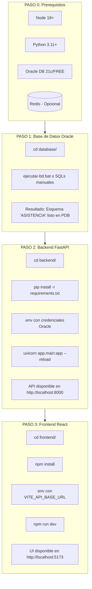
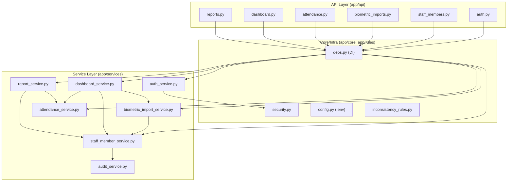
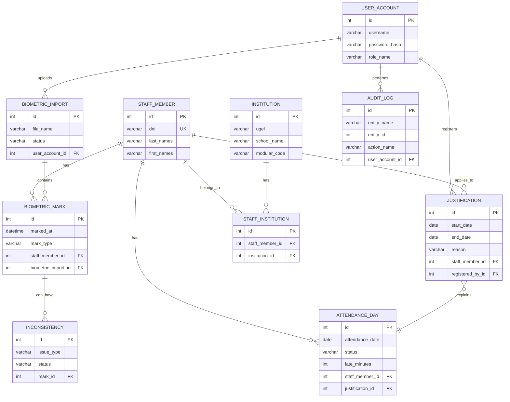
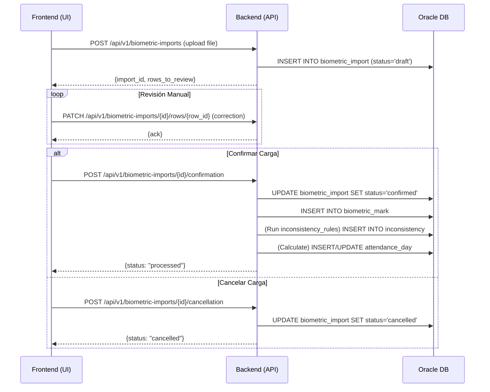

# Análisis Estructural: CHIQUISTRUKIS (Control de Asistencia)

Este documento resume la arquitectura, estructura y flujos de ejecución del proyecto `control-asistencia-ugel-maestria`, basado en el análisis de la rama `feature/build-project-with-codex`.

## 1. Stack Tecnológico

- **Frontend**: React, TypeScript, Vite
- **Backend**: Python, FastAPI
- **Base de Datos**: Oracle (scripts SQL para creación de esquema)
- **Caché/Sesión**: Redis (desactivado en la rama actual en favor de una sesión en memoria para desarrollo).
- **Tooling**: Codex (agentes para guiar el desarrollo), `ruff` y `black` para linting/formato en Python.

---

## 2. Diagrama de Ejecución: Cómo Levantar el Sistema

---

## 3. Arquitectura del Backend (FastAPI)

El backend sigue una arquitectura en capas, centrada en servicios que encapsulan la lógica de negocio.

**Puntos Clave:**
- **`deps.py`** centraliza la inyección de dependencias (como la autenticación de usuario) para todos los endpoints.
- **`attendance_service.py`** es el núcleo; `dashboard` y `reports` dependen de él.
- **`audit_service.py`** es utilizado por todos los servicios que realizan mutaciones para mantener un registro de cambios.

---

## 4. Modelo de Datos (Oracle)

El esquema de la base de datos está normalizado y centrado en las entidades `staff_member` y `attendance_day`.

**Fuente de Verdad**: La tabla `ATTENDANCE_DAY` es la fuente canónica de la asistencia diaria de una persona. El resto de las tablas (marcas, importaciones, justificaciones) alimentan o explican el estado de esta tabla.

---

## 5. Flujo Crítico: Wizard de Importación Biométrica

Este es el flujo de negocio más complejo y central del sistema.

---

## 6. Mapa de Capas y Carpetas

| Capa Lógica     | Carpeta Física        | Agente Responsable (Codex) |
|-----------------|-----------------------|----------------------------|
| **Presentación**| `frontend/`           | `frontend_react`           |
|                 | `disenos_base/`       | (Referencia para UI/UX)    |
| **API/Negocio** | `backend/app/api/`    | `backend_api`              |
|                 | `backend/app/services/`| `backend_api`              |
|                 | `backend/app/rules/`  | `backend_api`              |
| **Datos**       | `database/`           | `oracle_dba`               |
| **Infra**       | `infra/redis/`        | `ops` / `architect`        |
| **Testing**     | `backend/tests/`      | `qa_tester`                |
| **Docs**        | `docs/`               | `architect`                |

